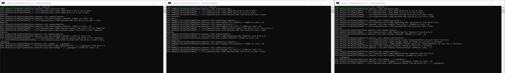

# LADCache - Locality Aware Distributed Cache
*Based on ideas from "Accelerating Data Loading in Deep Neural Network Training" (2019)*

## *Warning: this project is still a work-in-progress, and is not yet completely stable!*


*Demo of distributed cache with three nodes, using the interactive test mode.*

## Installation

```python setup.py install```

*Note: you may need to `chown` the created build folder for proper permissions.*

## Usage

### `ladcache.Cache(capacity: int, queue_depth: int, max_unsynced: Optional[int] = 1, n_users: Optional[int] = 1)`

Cache with `capacity` bytes of capacity, capable of handling `queue_depth` load requests in parallel. Allows at most `max_unsynced` files to be cached prior to syncing with peers, but will also sync after a short period without having cached any new files as long as there is at least a single uncached file. Supports up to `n_users` users in parallel, which each interact with the cache via a `ladcache.UserState` object obtained by calling `Cache.get_user_state(i)`, for the `i`th user.

#### `Cache.get_user_state(id: int)`

Get a reference to the `ladcache.UserState` object used by the `id`th user.

#### `Cache.spawn_process()`

Spawn the various sub-processes that manage the cache. Must be called before submitting or reaping requests.

### `ladcache.UserState`

#### `UserState.submit(filepath: str)`

Submit a request for `filepath` to be loaded. 

#### `UserState.reap(wait: Optional[bool] = True)`

Blocks until a fulfilled `ladcache.Request` can be reaped and returned. If `wait=False` then `None` will be returned if no request is ready.

### `ladcache.Request`

Fulfilled request, returned by `ladcache.UserState.reap()`. Request must be released (e.g., with `del`) once the user has finished using it in order to prevent leaking resources.

#### `Request.get_filepath()`

Returns the filepath this request loaded as `bytes` with a `utf-8` encoding.

#### `Request.get_data()`

Returns the data this request loaded as `bytes`.


## Project Structure

### `<repo>/csrc` - project source

#### `ladcache/cache.c` & `ladcache/cache.h`
Core implementation of distributed cache. Implements the cache in various sections:
* *Misc* - Utility functions that don't merit an entire file in `/csrc/utility/`.
* *Network* - Generalized functions to interact with peers across the network.
* *Monitor* - Monitor thread functions, used to implement the `monitor_loop` thread, which handles all networked aspected of the cache.
* *Local cache interface* - High level interface to the local cache (`contains`/`load`/`store`).
* *Remote cache interface* - High level interface to the remote cache (`contains`/`load`/`store`).
* *Manager* - Manager thread functions, used to implement the `manager_loop` thread, which handles all interactions with the users, and accesses to the local cache and local IO.
* *Generic interface* - Interface exposed to library users. Interacts with manager and monitor processes through various queues.
* *Allocation* - Creation, initialization, and teardown functions for the `cache_t` type.

At a high level there are 2 process scopes:
1. User (interacts with LADCache through shared queues, etc.)
2. Backend (manages the cache).

The user scope is composed of various processes that will use the cache, each of which has a unique `ustate_t` struct which contains queues in shared memory. Each user has their own queues, and there is no sharing between users. The user configures requests and moves them from the free queue into the ready queue in order to tell the backend to handle the configured requests. The user then retrieves completed requests from the done queue, and once finished with them, replaces them back into the free queue.

The backend scope is composed of two persistent threads.
1. The **manager** is in charge interacting with the ready queue and issuing both network and storage IO requests. Each request requiring network IO spawns a new thread which connects to a peer's monitor to request file data. Storage IO requests are fulfilled by the manager using io_uring.
2. The **monitor** is in charge of handling incoming network traffic from peers. There are various types of traffic, however the two most important types are *file requests* and *file syncs*. File requests contain a filepath and it is the monitor's responsibility to fetch the file data from its cache and send it to the requestor. File syncs contain updated remote cache information, indicating which peers have cached which file data.

#### `utils/alloc.c` & `utils/alloc.h`
Utility functions for memory allocation.

#### `utils/fifo.h`
Utility macros for FIFO queues.

#### `utils/log.c` & `utils/log.h`
Logging macros.

#### `utils/uthash.h`
Hash table macro library ([source](https://troydhanson.github.io/uthash/)).

#### `/ladcachemodule/ladcachemodule.c` - CPython wrapper
CPython wrapper implementation.

### `<repo>/test` - project tests

#### `c`
Tests for C interface. Currently only supports an interactive test mode where the user specifies which files should be loaded. To run, build the test with `make`, and then run the test with `./ladcache -i`.

#### `python`
Interactive tests for C interface and Python wrapper. Currently only supports an interactive test mode where the user specifies which directories should be loaded. Measures file loading speed. Use `python benchmark.py` to run.